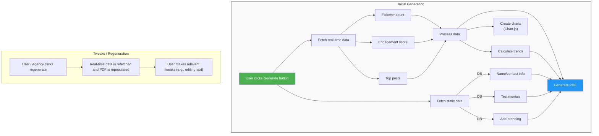

# Dynamic Media Kits for PlayersOnly
## Application Flow

```mermaid
flowchart TD
    subgraph Initial_Generation["Initial Generation"]
        A[User clicks Generate button] --> B[Fetch real-time data]
        A --> C[Fetch static data]
        D --> E[Generate PDF]

        %% Detailed sub-processes
        B --> B1["Follower count"]
        B --> B2["Engagement score"]
        B --> B3["Top posts"]
        B1 --> D[Process data]
        B2 --> D
        B3 --> D

        C -->|DB| C1["Name/contact info"]
        C -->|DB| C2["Testimonials"]
        C -->|DB| F2["Add branding"]
        C1 --> E
        C2 --> E
        
        D --> D1["Create charts<br/>(Chart.js)"]
        D --> D2["Calculate trends"]
        D2 --> E
        
        F2 --> E
    end
    subgraph Tweaks / Regeneration
        F[User / Agency clicks regenerate] --> G[Real-time data is refetched and PDF is repopulated]
        G --> H["User makes relevant tweaks (e.g., editing text)"]
    end

    style Initial_Generation fill:#f9f9f9,stroke:#666,stroke-width:2px
    style A fill:#4CAF50,color:white
    style E fill:#2196F3,color:white
```
